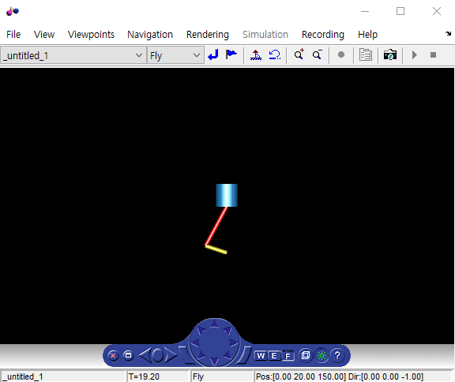

# MATLAB-simulink-piston
## 2018 SPRING MATLAB Term Project
### Simulation of a Pison using MATLAB GUI and Simulink

#### 과제 수행목적
* 매트랩 GUI를 만들 수 있는지, 시뮬링크를 짜고 3D VR과 연동 시킬 수 있는지 알아본다.

#### 과제 수행내용
* 매트랩 GUI를 통해 값을 입력 받고 시뮬링크와 3D VR을 연동하여 피스톤 운동을 애니매이션을 통해 볼 수 있게 한다.

## 수행 과정
1. 입력을 받는 크랭크의 위치와 각속도로 크랭크의 rotation, scale, translation과 피스톤의 translation을 구한다.   
2. 사용자가 모터속도, 크랭크 길이를 입력할 수 있도록 GUI를 작성한다.
3. 3D VR을 이용하여 피스톤의 대략적인 형태를 만들고 시뮬링크에서 사용자가 사용할 수 있도록 피스톤의 translation과 크랭크의 translation, scale, rotation을 시뮬링크의 VR sink와 연동시킨다. 
4. 시뮬링크에서 피스톤 운동을 할 수 있도록 피스톤과 크랭크의 위치, 크기 등을 지정해준다. 

## 실행 방법

